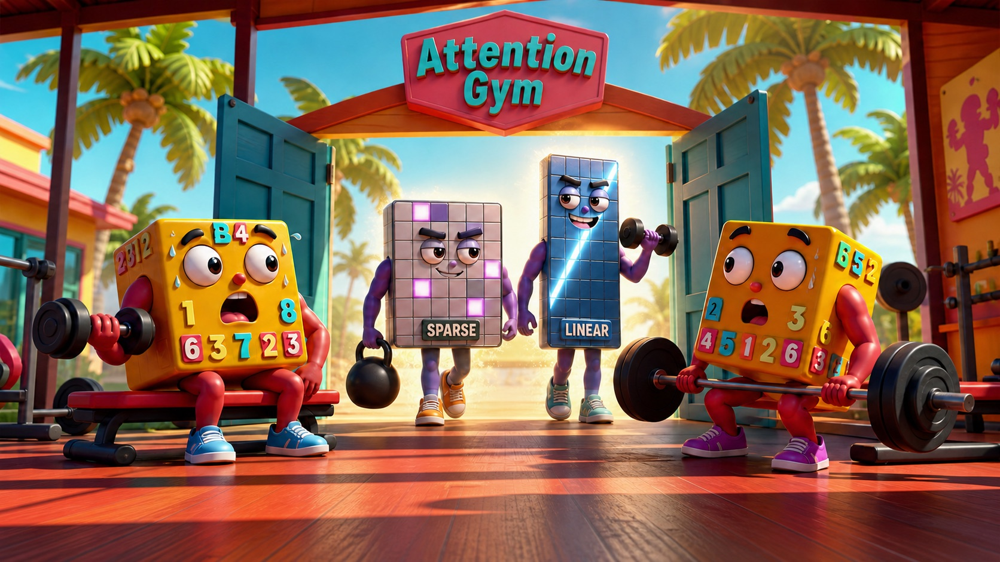

# Attention Gym

Attention Gym is a collection of kernels, guides, and examples for
[FlexAttention](https://pytorch.org/docs/main/nn.attention.flex_attention.html#module-torch.nn.attention.flex_attention)
and other novel attention variants.

[**📚 Docs**](https://meta-pytorch.github.io/attention-gym/) |
[**🎯 Features**](#-features) |
[**🚀 Getting Started**](#-getting-started) |
[**💻 Usage**](#-usage) |
[**🛠️ Dev**](#️-dev) |
[**🤝 Contributing**](#-contributing) |
[**⚖️ License**](#️-license)

## 📖 Overview

Attention Gym began as a library of examples showing the many ways to express attention variants with the
FlexAttention API. It is growing into a broader playground for attention, with the addition of sparse attention kernels, linear attention APIs for training and inference as well as showcasing how to use FlexAttention and friends in real workloads.



## 🎯 Features

- FlexAttention masks and score modifications
- Sparse attention patterns
- APIs and kernels for efficient GDN and KDA
- Utility functions for creating and combining attention masks
- Examples of how to use FlexAttention in real-world scenarios

## 🚀 Getting Started

### Prerequisites

- PyTorch (version 2.5 or higher)

### Installation

Install the official wheel from [PyPI](https://pypi.org/project/attn-gym/#files):

```bash
pip install attn-gym
```

The base package intentionally keeps its runtime dependency surface small: it depends only on
PyTorch (unpinned). Optional features live behind extras, so install only what you need:

```bash
pip install "attn-gym[linear]"  # Linear-attention APIs and kernels
pip install "attn-gym[viz]"     # Visualization and example dependencies
```

> [!WARNING]
> Attention Gym is under active development. We reserve the right to make
> backward-incompatible changes between releases. If you depend on a particular API or kernel
> behavior, hard-pin the version you test, for example:
> `pip install "attn-gym[linear]==X.Y.Z"`.

## 💻 Usage

Attention Gym supports three complementary workflows:

1. **Compose FlexAttention building blocks.** Import
   [`mask_mod`](attn_gym/masks) and [`score_mod`](attn_gym/mods) functions and pass them directly
   to PyTorch's FlexAttention APIs.
2. **Use sparse and linear-attention APIs and kernels.** Build with
   [`selected_attention`](attn_gym/sparse/selected_attention), GDN and KDA chunk, recurrent, and
   decode paths, and short-convolution primitives. See the
   [compressed sparse attention](examples/compressed_sparse_attention.py) and
   [delta-rule (KDA/GDN) training](examples/delta_rule_training.py) for working examples.
3. **Run real workloads and benchmarks.** The [`examples/`](examples) directory covers paged,
   ring, and variable sparse attention, CUDA Graphs, determinism, compilation, and profiling. Most
   of this should serve as inspiration for fun things you might build from our building blocks :)

## 🛠️ Dev

Install dev requirements
```bash
pip install -e ".[dev]"
```

Install and run the repository hooks:

```bash
prek install
prek run --all-files
```

## 🤝 Contributing
We welcome contributions to Attention Gym, especially new Masks or score mods! Here's how you can contribute:

### Contributing Mods

1. Create a new file in the [attn_gym/masks/](attn_gym/masks) for mask_mods or [attn_gym/mods/](attn_gym/mods) for score_mods.
2. Implement your function, and add a simple main function that showcases your new function.
3. Update the `attn_gym/*/__init__.py` file to include your new function.
4. Optionally, add an end-to-end example using your new function in the [examples/](examples/) directory.

See [CONTRIBUTING.md](CONTRIBUTING.md) for more details.

## ⚖️ License

Attention Gym-authored code is released under the BSD 3-Clause License. Vendored third-party
components retain the licenses and notices included alongside their source.
