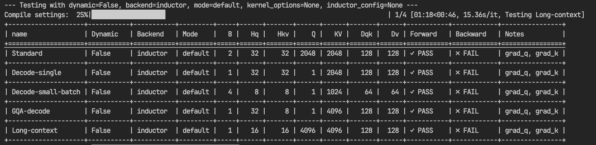
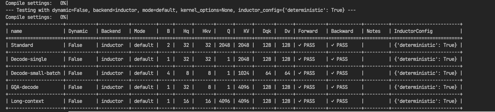
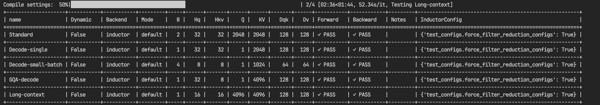

# FlexAttention Determinism

Run-to-run determinism is important for workloads such as long reinforcement-learning rollouts and Mixture-of-Experts models. This guide explains how to make FlexAttention produce bitwise-identical results across repeated runs on the same hardware and software stack.

The accompanying [`examples/flex_determinism.py`](https://github.com/meta-pytorch/attention-gym/blob/main/examples/flex_determinism.py) script tests the behavior described below across standard attention, decoding, grouped-query attention, and long-context shapes.

!!! note
    This guide covers repeatability between runs with the same environment. It does not guarantee bitwise equivalence across different PyTorch or compiler versions, GPU architectures, or kernel configurations.

## Recommended settings

### Forward pass

Use static shapes and Inductor's default compilation mode:

```python
compiled_flex_attention = torch.compile(
    flex_attention,
    dynamic=False,
    backend="inductor",
    mode="default",
)
```

### Forward and backward passes

Also enable deterministic Inductor reductions:

```python
import torch
import torch._inductor.config
from torch.nn.attention.flex_attention import flex_attention


torch._inductor.config.deterministic = True

compiled_flex_attention = torch.compile(
    flex_attention,
    dynamic=False,
    backend="inductor",
    mode="default",
)
```

`torch._inductor.config.deterministic = True` is required for backward-pass determinism because FlexAttention's backward graph contains a reduction whose configuration can otherwise vary during autotuning.

## Sources of numerical variation

Several compiler and kernel choices can affect bitwise results.

### Autotuning

With modes such as `max-autotune-no-cudagraphs`, Inductor benchmarks multiple kernel configurations. If several configurations perform similarly, normal benchmark noise can change which configuration wins. Different block sizes or reduction strategies can perform floating-point operations in a different order, producing different bit patterns.

Resource contention can have the same effect: a competing workload may temporarily slow one candidate and change the selected configuration.

### Dynamic shapes

FlexAttention lowering uses known sequence lengths to choose block sizes and divisibility assumptions. Static and dynamic compilation can therefore produce kernels with different numerical behavior even when they receive tensors with the same concrete shapes.

Use `dynamic=False` when bitwise repeatability is required, and keep the shape and compilation settings consistent between runs.

### Gradients for captured buffers

When a `score_mod` captures buffers that require gradients, the backward pass may use atomics to accumulate those gradients. Atomic accumulation order is not deterministic. This only applies when differentiating captured buffers; it is not part of the common query, key, and value gradient path.

## Why backward needs deterministic reductions

The FlexAttention backward pass first computes a delta term equivalent to `sum(output * grad_output)`, then uses it in the main backward kernel. This reduction is generated by Inductor rather than by the main FlexAttention kernel.

Reduction order matters for floating-point arithmetic. If autotuning selects a different reduction configuration, the delta tensor can change at the bit level. Query and key gradients depend on delta, while value gradients do not. In testing, this appeared as deterministic forward output and value gradients but non-deterministic query and key gradients.

The following run deliberately randomized autotuning choices and exposed the issue:



Enabling Inductor's deterministic mode made both forward and backward results repeatable:



The diagnosis was also confirmed with Inductor's testing-only `force_filter_reduction_configs` option, which restricts reduction autotuning to a consistent configuration:



These `test_configs` options are intended for PyTorch compiler testing and diagnosis. Use `torch._inductor.config.deterministic = True` in application code instead.

## Determinism and performance

FlexAttention often benefits from `max-autotune-no-cudagraphs` because the best kernel configuration depends on the specific `score_mod`, `mask_mod`, shape, and hardware. However, selecting a configuration at runtime introduces another source of run-to-run variation.

For both performance and determinism:

1. During development, benchmark with `max-autotune-no-cudagraphs` to find a good configuration for the production workload.
2. Record the selected FlexAttention kernel settings.
3. In production, compile with `mode="default"` and pass the recorded settings through [`kernel_options`](https://docs.pytorch.org/docs/stable/nn.attention.flex_attention.html#torch.nn.attention.flex_attention.FlexKernelOptions).
4. Keep `dynamic=False` and enable `torch._inductor.config.deterministic` when backward-pass determinism is required.

Pinning `kernel_options` prevents FlexAttention's main kernels from changing configuration, while deterministic Inductor mode fixes the reduction configuration used by the surrounding backward graph.

## Reproducing the tests

Run the repository's determinism example on a CUDA system:

```bash
python examples/flex_determinism.py
```

The script resets compiler state and uses fresh Inductor caches between runs so that it tests repeatability across independent compilations rather than repeatedly executing one cached kernel.

## References

- [FlexAttention API reference](https://docs.pytorch.org/docs/stable/nn.attention.flex_attention.html)
- [FlexAttention determinism test script](https://github.com/meta-pytorch/attention-gym/blob/main/examples/flex_determinism.py)
- [Inductor deterministic configuration](https://github.com/pytorch/pytorch/blob/901bbcba122825c817cac9e0b88221096fcd74ae/torch/_inductor/config.py#L712)
- [Inductor benchmark-distortion test configuration](https://github.com/pytorch/pytorch/blob/901bbcba122825c817cac9e0b88221096fcd74ae/torch/_inductor/config.py#L2102)
- [Inductor reduction-filter test configuration](https://github.com/pytorch/pytorch/blob/901bbcba122825c817cac9e0b88221096fcd74ae/torch/_inductor/config.py#L2094)
- [PyTorch reduction determinism fix](https://github.com/pytorch/pytorch/pull/165729)
