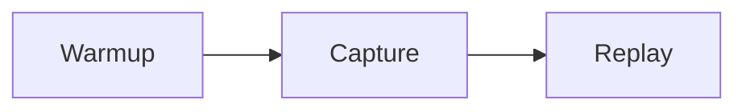
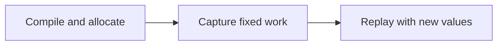

# Documentation Authoring

Attention Gym uses Material for MkDocs. Tutorial pages can combine ordinary Markdown with tabs,
admonitions, code annotations, Mermaid diagrams, source-file inclusion, and interactive HTML or
JavaScript widgets.

## Rich Markdown

### Tabs

Use tabs to compare alternatives without repeating surrounding explanation:

```markdown
=== "Graph-safe"

    ```python
    static_input.copy_(new_input)
    graph.replay()
    ```

=== "Requires recapture"

    ```python
    static_input = new_input
    ```
```

### Admonitions and details

Use admonitions for important contracts and collapsible details for optional depth:

```markdown
!!! warning "Captured storage is persistent"
    Replaying the graph overwrites its captured output buffers.

??? note "Why addresses must remain stable"
    CUDA Graph nodes retain the arguments recorded during capture.
```

### Code annotations

Annotations keep explanations next to the relevant operation:

```python
static_input.copy_(new_input)  # (1)!
graph.replay()
```

1. Mutate captured storage instead of replacing it with a new tensor.

### Diagrams

Mermaid diagrams are rendered directly from fenced blocks:

````markdown

````



### Include repository source

Use snippets when the documentation should show code owned by an executable example rather than a
second, manually copied version:

```markdown
--8<-- "examples/example.py"
```

Keep snippets focused. Link to the complete example when including the whole file would interrupt
the tutorial.

## Interactive widgets

Choose the smallest integration that fits the interaction.

### Page-local widget

For a small control or visualization, add a mount point to the Markdown page and load a script from
`docs/assets/javascripts/`:

```html
<div id="cuda-graph-demo" class="tutorial-demo"></div>
<script src="../assets/javascripts/cuda-graph-demo.js"></script>
```

The existing [CI Health](ci-health.md) dashboard uses this pattern. Put shared styling in
`docs/stylesheets/extra.css`.

### Standalone widget

For a larger application, isolate its markup, styling, and JavaScript under
`docs/assets/widgets/<name>/`:

```text
docs/assets/widgets/cuda-graph-replay/
|-- index.html
|-- widget.css
`-- widget.js
```

Embed it from a tutorial with an iframe:

```html
<iframe
  class="tutorial-widget"
  src="../assets/widgets/cuda-graph-replay/index.html"
  title="CUDA Graph replay visualization"
  loading="lazy"
></iframe>
```

Standalone widgets avoid leaking application styles into the documentation theme and remain easy
to open and test independently.

### Global behavior

If several pages share the same widget runtime, register one script in `mkdocs.yml` rather than
loading it from every page:

```yaml
extra_javascript:
  - assets/javascripts/tutorial-widgets.js
```

Do not add a Node build merely for a small interaction. Introduce a JavaScript or TypeScript bundle
step only when a widget has enough shared state, dependencies, or components to justify it.

## Generated results

The documentation build runs on a CPU-only GitHub Actions worker. Generate CUDA measurements,
traces, and screenshots separately, then commit stable JSON or image artifacts under
`docs/assets/`. Browser widgets may visualize those artifacts but should not imply that CUDA code
is executing in the page.

## Validation

Preview changes locally:

```bash
pip install -e ".[docs]"
mkdocs serve
```

Before submitting documentation changes, run the same strict build used by CI:

```bash
mkdocs build --strict
```
