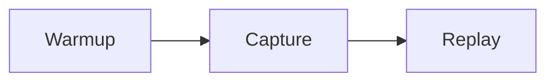
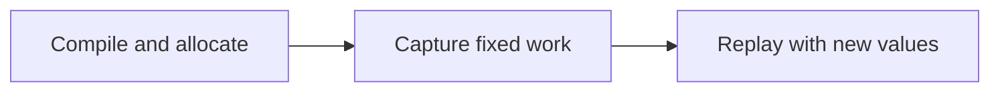

# Documentation Authoring

Attention Gym uses Material for MkDocs. Tutorial pages can combine ordinary Markdown with tabs,
admonitions, code annotations, Mermaid diagrams, source-file inclusion, and interactive HTML or
JavaScript widgets.

## Reusable macros

Parameterized documentation components live in repo-root `main.py` and are provided by
`mkdocs-macros-plugin`.

Use a Jinja call block when a component wraps normal Markdown:

```jinja

Markdown containing the exact phrase.

```

Use an expression macro when it emits the complete component:

```jinja
{{ perfetto_trace("trace_basename", title="Trace title", alt="Useful description") }}
```

Generated Plotly dashboards and standalone widgets use the same expression form:

```jinja
{{ plotly_chart("chart_basename", title="Interactive benchmark results") }}
{{ html_widget(
    "cuda-graph-memory/comparison.html",
    title="Interactive memory comparison",
    classes="memory-viz-frame",
) }}
```

Use `capacity_symbol` when CUDA Graph prose refers to the recurring capacity and active-work
symbols. This keeps their colors and hover descriptions consistent across a tutorial:

```jinja
The replay may use {{ capacity_symbol("L") }} active rows from a
{{ capacity_symbol("T_max") }}-row captured buffer.
```

The replay may use {{ capacity_symbol("L") }} active rows from a
{{ capacity_symbol("T_max") }}-row captured buffer.

Supported symbols are `T`, `T_max`, `L`, `N`, and `M`. Keep equations and executable code literal;
use the macro for explanatory prose where the recurring visual anchor helps the reader.

A shared macro should own its HTML structure, escaping, accessibility attributes, unique IDs, and
page-relative asset paths. Add a macro when a parameterized HTML shape is repeated or expected to
appear in another tutorial; keep one-off diagrams and application mount points explicit. Document a
copyable invocation here and include a rendered example so `mkdocs build --strict` exercises it.

## Rich Markdown

### Tabs

Use tabs to compare alternatives without repeating surrounding explanation:

```markdown
=== "Graph-safe"

    ```python
    static_input.copy_(new_input)
    graph.replay()
    ```

=== "Requires recapture"

    ```python
    static_input = new_input
    ```
```

### Admonitions and details

Use admonitions for important contracts and collapsible details for optional depth:

```markdown
!!! warning "Captured storage is persistent"
    Replaying the graph overwrites its captured output buffers.

??? note "Why addresses must remain stable"
    CUDA Graph nodes retain the arguments recorded during capture.
```

### Code annotations

Annotations keep explanations next to the relevant operation:

```python
static_input.copy_(new_input)  # (1)!
graph.replay()
```

1. Mutate captured storage instead of replacing it with a new tensor.

Material computes annotation tooltip coordinates from the control's normal in-flow position. Keep
`.md-annotation` and its code-line ancestors statically positioned; moving the control with
`position` or `transform` can send the tooltip offscreen even though the click state changes. Apply
full-row emphasis with the same negative-margin and padding geometry used by Material's highlighted
lines instead.

### Diagrams

Mermaid diagrams are rendered directly from fenced blocks:

````markdown

````



### Include repository source

Use snippets when the documentation should show code owned by an executable example rather than a
second, manually copied version:

```markdown
--8<-- "examples/example.py"
```

Keep snippets focused. Link to the complete example when including the whole file would interrupt
the tutorial.

### Sidenotes

Use the `sidenote` macro for supplementary context that should remain visually separate from the
main argument. Give it the exact phrase to mark and the note content; write the surrounding content
as ordinary Markdown inside the call block:

```jinja

The main explanation contains an exact phrase that remains part of the normal reading flow.

```


The rendered example contains an exact phrase without requiring hand-written HTML or accessibility
attributes.


The macro generates the `.with-sidenote` wrapper, dotted phrase, unique ID, `aria-describedby`, and
matching `<aside>`. Pass `note_id="stable-id"` only when another element must reference a specific
ID. The implementation lives in `main.py`.

On wide screens, the note occupies the right table-of-contents gutter and the page TOC is hidden to
prevent overlap. On narrow screens, the note becomes a temporary popover revealed by hovering or
focusing its exact phrase. Hover and keyboard focus are bidirectional: interacting with either side
adds a soft accent wash behind the phrase and a matching stripe beside the note. This shared ink cue
shows the correspondence without a gutter box or halo. Use sidenotes only for optional
context, avoid nearby notes whose gutter content would overlap, and keep nested raw HTML flush-left:
four leading spaces can make MkDocs interpret it as a code block and break the surrounding page
layout.

#### Hover-media sidenotes

Add `sidenote--hover-media` when the gutter should remain empty until the reader hovers or focuses
the dotted phrase:

```html
<div class="with-sidenote" markdown="1">
<div markdown="1">

The profiler makes these
<span class="sidenote-ref" tabindex="0" aria-describedby="profiler-meme">labels visible</span>.

</div>

<aside id="profiler-meme" class="sidenote sidenote--hover-media">
<a href="https://example.com/original-source" aria-label="View the original animation">

</a>
</aside>
</div>
```

Store animations locally under `docs/assets/`, prefer an optimized animated WebP over a large GIF,
and keep a link to the original source. Always provide useful alternative text and verify both hover
and keyboard focus in the local preview.

## Interactive widgets

Choose the smallest integration that fits the interaction.

### Page-local widget

For a small control or visualization, add a mount point to the Markdown page and load a script from
`docs/assets/javascripts/`:

```html
<div id="cuda-graph-demo" class="tutorial-demo"></div>
<script src="../assets/javascripts/cuda-graph-demo.js"></script>
```

The existing [CI Health](ci-health.md) dashboard uses this pattern. Put shared styling in
`docs/stylesheets/extra.css`.

### Perfetto traces

Use the `perfetto_trace` macro when a committed PNG and `.pftrace` share the same basename:

```jinja
{{ perfetto_trace(
    "hello_world_training_loop",
    title="Realistic CUDA Graph training loop",
    alt="Perfetto trace for the realistic training loop",
) }}
```

The macro computes the page-relative asset path and emits the snapshot button, lazy iframe, restore
control, accessible labels, and unique element ID. Do not copy the underlying widget HTML into a
page.

### Plotly charts

Generate standalone Plotly HTML under `docs/assets/plots/`, then embed it with the
`plotly_chart` macro:

```jinja
{{ plotly_chart(
    "kda_cuda_graph_scheduler",
    title="KDA CUDA Graph scheduler scaling",
) }}
```

Use `include_plotlyjs="cdn"` when generating the HTML so the committed artifact contains only the
figure data and remains small. Configure responsive sizing in the Plotly figure, omit a fixed layout
`width`, and preserve the raw CSV or JSON that produced it outside the documentation build. The macro
uses a 560 px chart height by default and includes the iframe border automatically; pass `height=`
when the generated figure uses a different height.
`plotly-theme.js` supplies the tutorial palette, Plex typography, matching surfaces, live light/dark
theme synchronization, and forwards chart wheel events to the documentation page instead of zooming
the plot.

The theme script is registered once in `mkdocs.yml`; pages should not import it themselves. It styles
the same-origin iframe emitted by `plotly_chart`, so generated HTML must contain a standard
`.plotly-graph-div`. Trace names receive the site palette automatically, while scheduler traces may
use `policy: distribution` names to encode policy by color and distribution by dash and marker shape.
Do not enable Plotly `scrollZoom`, hard-code a chart background, or add another internal chart title.
Validate a new chart in wide dark mode, through the real Material light-mode toggle, and at a narrow
viewport.

### Standalone widget

For a larger application, isolate its markup, styling, and JavaScript under
`docs/assets/widgets/<name>/`:

```text
docs/assets/widgets/cuda-graph-replay/
|-- index.html
|-- widget.css
`-- widget.js
```

Embed it from a tutorial with `html_widget` so nested pages get the correct asset path:

```jinja
{{ html_widget(
    "cuda-graph-replay/index.html",
    title="CUDA Graph replay visualization",
) }}
```

Standalone widgets avoid leaking application styles into the documentation theme and remain easy
to open and test independently.

The CUDA Graph memory comparison is a single-file example:

```jinja
{{ html_widget(
    "cuda-graph-memory/max-vs-four-shared-buckets.html",
    title="Memory comparison of one maximum graph and four shared-buffer buckets",
    classes="memory-viz-frame",
) }}
```

Keep that artifact under `docs/assets/widgets/cuda-graph-memory/` and use the shared
`memory-viz-frame` class for its tutorial height. The HTML owns its diagnostic UI and can be opened
directly for browser QA; do not paste its markup into Markdown.

### Global behavior

If several pages share the same widget runtime, register one script in `mkdocs.yml` rather than
loading it from every page:

```yaml
extra_javascript:
  - assets/javascripts/tutorial-widgets.js
```

Do not add a Node build merely for a small interaction. Introduce a JavaScript or TypeScript bundle
step only when a widget has enough shared state, dependencies, or components to justify it.

## Generated results

The documentation build runs on a CPU-only GitHub Actions worker. Generate CUDA measurements,
traces, and screenshots separately, then commit stable JSON or image artifacts under
`docs/assets/`. Browser widgets may visualize those artifacts but should not imply that CUDA code
is executing in the page.

## Validation

Preview changes locally:

```bash
pip install -e ".[docs]"
mkdocs serve
```

Before submitting documentation changes, run the same strict build used by CI:

```bash
mkdocs build --strict
```
