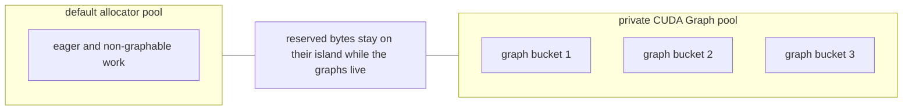

# So you wanna CUDA Graph

GPUs continue to get faster and their hunger for kernel launches driven by the CPU is seemingly insatiable. A natural solution to this problem is `cuda graphs`. The post will walk through some common footguns both in kernel design and user invocation for ragged kernels, how to alleviate them and where there is still room to
improve today - especially at the framework level.

### What are ragged kernels?

<div class="with-sidenote" markdown="1">
<div markdown="1">

Most sequence data comes from an underlying distribution and does not have one exact length - unless the data is boring. A batch of documents, conversations, or videos therefore has a different number of tokens per sample. "But Tensors are regular! What am I to do" You say, the normal solution truncates or pads every sample to a fixed length.

A <span class="sidenote-ref" tabindex="0" aria-describedby="ragged-terminology-note">ragged</span> representation instead packs only the real tokens into one contiguous buffer:

<div class="ragged-viz" role="img" aria-label="A padded PyTorch tensor with shape batch three by maximum sequence length four by feature dimension contains nine real token vectors and three padding slots. Packing removes the padding to produce a nine by feature-dimension tensor. Its sequence metadata is cumulative sequence lengths zero, four, six, and nine with shape batch plus one, or four.">
<div class="ragged-viz__stage">
<div class="ragged-viz__meta">
<span>before · x_padded</span>
<code>[B, max_T, D] = [3, 4, D]</code>
</div>
<div class="ragged-viz__padded">
<span class="ragged-viz__cell ragged-viz__a">A</span>
<span class="ragged-viz__cell ragged-viz__a">A</span>
<span class="ragged-viz__cell ragged-viz__a">A</span>
<span class="ragged-viz__cell ragged-viz__a">A</span>
<span class="ragged-viz__cell ragged-viz__b">B</span>
<span class="ragged-viz__cell ragged-viz__b">B</span>
<span class="ragged-viz__cell ragged-viz__pad">∅</span>
<span class="ragged-viz__cell ragged-viz__pad">∅</span>
<span class="ragged-viz__cell ragged-viz__c">C</span>
<span class="ragged-viz__cell ragged-viz__c">C</span>
<span class="ragged-viz__cell ragged-viz__c">C</span>
<span class="ragged-viz__cell ragged-viz__pad">∅</span>
</div>
</div>
<div class="ragged-viz__action"><strong>9 / 12 slots are real</strong> · remove padding and pack <span aria-hidden="true">↓</span></div>
<div class="ragged-viz__stage">
<div class="ragged-viz__meta">
<span>after · x_packed</span>
<code>[T, D] = [9, D]</code>
<span>metadata · cu_seqlens</span>
<code>[len(docs) + 1] = [B + 1] = [4]</code>
</div>
<div class="ragged-viz__packed-wrap">
<div class="ragged-viz__packed">
<span class="ragged-viz__segment ragged-viz__a" style="grid-column: 1 / 5" data-end="4">A A A A</span>
<span class="ragged-viz__segment ragged-viz__b" style="grid-column: 5 / 7" data-end="6">B B</span>
<span class="ragged-viz__segment ragged-viz__c ragged-viz__segment--last" style="grid-column: 7 / 10" data-end="9">C C C</span>
<span class="ragged-viz__start">0</span>
</div>
<code class="ragged-viz__tensor">cu_seqlens = tensor([0, 4, 6, 9], dtype=torch.int32)</code>
</div>
</div>
</div>

The metadata preserves the logical boundaries: sequence `i` occupies `tokens[cu_seqlens[i]:cu_seqlens[i + 1]]`. Operations like attention use this information to prevent tokens from interacting when they don't belong to the same document. Token-parallel operations like projections do not care about these boundaries, and operate directly on the packed `[T, D]` tensor. This means we only do work for the real tokens - none of the padding.

</div>

<aside id="ragged-terminology-note" class="sidenote" markdown="1">

There are a million different names around this idea: ragged, varlen, packed, jagged, nested tensors, etc. I will use ragged and varlen interchangeably in this doc.

</aside>
</div>

### What is a CUDA Graph


Its a graph. Duh, but really - the common PyTorch usage and definition is that its a way to `record` all kernel launches done by a given pytorch program and then `replay` this program at some point later. Why would you want to do this? Because if you know exactly what you want to launch you dont need to do any of the actual pytorch work to invoke these kernels 1 by 1. Instead you can launch this full `Graph` in one go and remove a majority if not all the CPU overhead.


#### Hello World

Lets setup a small test program, since this is attn_gym we will focus on a simple proxy attention module. However, the learnings will apply to both varlen attention and the new linear-attention variants we are adding to the gym. I will start with varlen for now in the examples.

```python
--8<-- "examples/cuda_graphs.py:hello-world"
```

1. simple wrapper around the standard pytorch profiler

run it and see how where the very expensive gpu is spending its time:

{{ perfetto_trace(
    "hello_world_no_cuda_graphs",
    title="Hello World without CUDA Graphs",
    alt="Perfetto trace for the Hello World example without CUDA Graphs",
) }}



This is somewhat a contrived example since we are using small model dim and token counts, regardless "We Bought the Whole GPU, So We're Damn Well Going to Use the Whole GPU" if we can.


#### Graph Time

PyTorch's api pretty closely mirror the lower level gpu apis for CG (CUDA Graphs, im done writing those two words). The first step is to `capture a series of operations`

```python
--8<-- "examples/cuda_graphs.py:capture-graph"
```

1. We use a side stream to isolate the exact work we want to record.
2. We warmup to initialize any lazy CUDA state such as library handles and then wait on it before the real capture.

```python
--8<-- "examples/cuda_graphs.py:hello-world-graph"
```

1. its replay time!

{{ perfetto_trace(
    "hello_world_with_cuda_graphs",
    title="Hello World with CUDA Graphs",
    alt="Perfetto trace for the Hello World example with CUDA Graphs",
) }}

We can see from the trace that overall the program is running much faster and more importantly no gaps between kernels on the gpu stream! Note that the 46us `cudaGraphLaunch` is still inflated by profiling and if one measures in isolation (on my machine) this is about ~9us. In general, when I `look` for cpu overhead I use the pytorch profiler but when I want to `measure` the overhead I use pythons built in timer.

This hello world is good for getting a general feel but time to make it real.

#### Terminology time

<div class="capacity-glossary" markdown="1">

<div class="capacity-definition capacity-definition--tokens" markdown="1">

<span class="capacity-term capacity-term--lead">Max Tokens {{ capacity_symbol("T") }}</span>

The physical token capacity of the static input buffers. The captured graph always sees tensors with {{ capacity_symbol("T") }} token rows. When we capture the worst case, {{ capacity_symbol("T") }} = {{ capacity_symbol("T_max") }}.

<div class="with-sidenote capacity-sidenote" markdown="1">
<div markdown="1">

On replay, <span class="capacity-term">Active Tokens {{ capacity_symbol("L") }}</span> is the amount of real token data. It is available on device as `cu_seqlens[-1]`, and must satisfy <span class="sidenote-ref" tabindex="0" aria-describedby="active-token-capacity-note">{{ capacity_symbol("L") }} &lt;= {{ capacity_symbol("T") }}</span>.

</div>

<aside id="active-token-capacity-note" class="sidenote" markdown="1">

If {{ capacity_symbol("L") }} was greater than {{ capacity_symbol("T") }} where would the `L-T` tokens go?

</aside>
</div>

</div>

<div class="capacity-definition capacity-definition--sequences" markdown="1">

<span class="capacity-term capacity-term--lead">Max Sequences {{ capacity_symbol("N") }}</span>

The number of sequence slots supported by the captured graph. This fixes the shape of `cu_seqlens` to `[N + 1]`.

<div class="with-sidenote capacity-sidenote capacity-sidenote--sequences" markdown="1">
<div markdown="1">

On replay, <span class="capacity-term">Active Sequences {{ capacity_symbol("M") }}</span> may be smaller than {{ capacity_symbol("N") }}. The <span class="sidenote-ref" tabindex="0" aria-describedby="unused-sequence-capacity-note">unused tail</span> is represented by repeating the active token endpoint: `[0, ..., L, L, L]`.

</div>

<aside id="unused-sequence-capacity-note" class="sidenote" markdown="1">

The unused sequence slots have 0 length, since length ==> `cu_seqlen[i+1] - cu_seqlen[i] = L - L = 0`

</aside>
</div>

</div>

</div>

---

The graph therefore keeps the physical [{{ capacity_symbol("T") }}, D] and [{{ capacity_symbol("N") }} + 1] shapes fixed. Each replay changes only the logical workload: {{ capacity_symbol("L") }} &lt;= {{ capacity_symbol("T") }} and {{ capacity_symbol("M") }} &lt;= {{ capacity_symbol("N") }}.

### More Realistic Training Loop

<details class="code-disclosure" markdown="1">
<summary>Packed batch loader</summary>

```python
--8<-- "examples/cuda_graphs.py:training-batches"
```

</details>

```python
--8<-- "examples/cuda_graphs.py:realistic-training-loop"
```

1. `token_capacity` is a policy typically chosen by the data pipeline and whatever your global batchsize you found acceptable for your model arch. Every replay must satisfy {{ capacity_symbol("L") }} &lt;= {{ capacity_symbol("T") }}; a batch with more real tokens must be split, rejected, or sent to a graph captured with a larger capacity.
2. `sequence_capacity` is another data-pipeline hard to define quantity in practice. If the only guarantee is that a nonempty sequence contains at least one token, the worst case is {{ capacity_symbol("T") }} one-token sequences, so {{ capacity_symbol("N") }} &lt;= {{ capacity_symbol("T") }}. While this truly is the worst case; figuring out what the max should be can require a full scan over your dataset. This is often intractable.
3. Varlen attention also requires a static maximum sequence length. This must be the max out of all the {{ capacity_symbol("N") }} sequences. Similarly to {{ capacity_symbol("T") }} being the worst case `sequence_capacity`, if you have 1 massive sequence that takes up the full token budget the max-seqlen would == {{ capacity_symbol("T") }}. I will argue later on that this is a dumb argument and that there are established patterns to avoid needing to know this hyperparam with minimal perf hit.
4. This synthetic loader yields the capacity-sized batch first. Capture therefore sees the largest physical token buffer and all {{ capacity_symbol("N") }} sequence slots; later batches only change the values copied into those same static tensors.
5. checkout our fancy new use of `mark_kernels`, learn more in the next section
6. `torch.autograd.grad` makes each parameter gradient an explicit output of the fwd+bwd graph. Just like `loss`, these tensors keep the same graph-pool addresses across replay.
7. The first replay produces the graph outputs for the first batch before we hand its gradients to eager Adam.
8. `parameter.grad = grad` attaches those graph outputs to the ordinary optimizer interface. This assignment changes the Python Tensor reference; it does not copy the gradient.
9. The fused Adam step stays eager and outside the CUDA Graph. It updates parameters in place, so the parameter addresses recorded by the graph remain valid.
10. `set_to_none=True` only removes the `parameter.grad` references. The `graph_grads` tuple still owns the graph outputs, replay writes the next gradients into the same storage and we attach them again before `optimizer.step()`.

This example is a little more faithful to a realistic training loop. The optimizer step is deliberately outside the CUDA Graph, while forward and backward are replayed together. The main thing to highlight is the usage of `static` inputs and outputs. CG's will replay the **EXACT** series of pytorch operations that it saw at capture time. This includes reusing the exact memory address / Tensors it saw during capture.


We need to make sure the memory / Tensors that are used during training are alive for the life time of CG. Luckily enough for us the parameters of our model satisfy this and are updated in place. Our inputs and outputs typically do not - so we setup their `static` buffers ahead of time and keep the graph outputs alive. Frameworks like titan have some [nice utilities](https://github.com/pytorch/torchtitan/blob/2807d3f550fe27db18bd9395ba63176364eaed6d/torchtitan/distributed/cudagraph.py#L189) for hiding the copy_ from temporaries to static inputs but for us we directly copy in from our dataloader batch.


What about intermediaries? This module produce intermediate in projections prior to calling attention. How do we ensure that this output always lands in exactly the right the slot? Even if we could ensure that how do we keep this tensor alive between graph replays??

## TODO answer this with a memory viz trace

The thing to explain here is that the graph does not keep every intermediate Python Tensor alive. During capture the caching allocator gives intermediates addresses from a graph-private pool and the kernels record those exact addresses. On replay Python and the allocator do not recreate the intermediates; CUDA just launches the recorded kernels reading and writing the same addresses. The allocator owns the private pool, while the `CUDAGraph` object retains a reference to it and prevents its memory from being returned to the normal pool.

Make a tiny example where the static input and output are small but the captured function creates a much larger intermediate. Record memory snapshots at each point and use the memory viz to show:

1. Before capture we only have the static input, output and parameters.
2. After capture allocated/reserved memory grows by much more than the inputs because the graph-private pool is holding the intermediate high-water mark.
3. Replaying the graph creates no new allocator activity. The kernels write to and read from the addresses frozen during capture.
4. Deleting only an intermediate Python variable does nothing special; it already disappeared after capture and the graph still needs its address.
5. Delete the graph, captured outputs and any other graph sharing its pool, then call `gc.collect()`. This drops the final references and makes the private pool eligible to be freed. Call `torch.cuda.empty_cache()` if we want the snapshot to show the now-unused cached segment actually returned to CUDA.

Maybe also capture a second graph with `pool=first_graph.pool()`. Deleting only the first graph should not release the pool because the second graph still retains it. Deleting the final graph and captured tensors should. This gives us a concrete way to show that graphs retain the pool, they do not retain a giant list of intermediate Tensor objects.

#### Small Digression into profiling

<div class="with-sidenote" markdown="1">
<div markdown="1">

Eager code is great. It works seamlessly with the stock pytorch profiler - providing plenty of info for an intrepid user. One very handy feature is `record_function` that lets users annotate regions of your code and have these <span class="sidenote-ref" tabindex="0" aria-describedby="profiler-label-meme-note">labels land on the perfetto trace</span>. If you have gigs to spare you might even use `with_stacks=True` and get a microscopic view of the world. This is not the same for cuda-graphs, historically. Below is an example of what the stock profiler might produce.

</div>

<aside id="profiler-label-meme-note" class="sidenote sidenote--hover-media">
<a href="https://tenor.com/view/nice-smack-delicious-meme-gif-8375212" aria-label="View the Nice Smack meme on Tenor">

</a>
</aside>
</div>

{{ perfetto_trace(
    "hello_world_training_loop",
    title="Realistic CUDA Graph training loop",
    alt="Perfetto trace for the realistic CUDA Graph training loop",
) }}

If you click and expand this perfetto trace; you can see which graph launch owns what kernels, their graph and node ids, launch metadata and dependency arrows. This is already useful, but the graph still looks like a wall of kernel names. We can do better!

At PyTorch we believe observability is only becoming more important. What used to take ages for an individual developer to digest can take an agent seconds, provided we give it structured traces instead of screenshots and a wall of kernel names;


**1.** There are new CUDA Graph annotation APIs. Python does not run the individual operators again when a graph is replayed, so `record_function` cannot recover the internal regions after capture. [`mark_kernels`](https://docs.pytorch.org/docs/stable/generated/torch.cuda.graph_annotations.mark_kernels.html) records metadata while the graph is being captured, and [`enable_annotations=True`](https://docs.pytorch.org/docs/stable/generated/torch.cuda.graph.html) keeps the mapping from graph nodes back to those labels. With this info stored on the graph nodes we can write postprocessors like: [transformer-nuggets post processing](https://github.com/drisspg/transformer_nuggets/blob/742466ecdfe9e616210cb32f415f95b3c213cc53/transformer_nuggets/utils/perfetto.py#L98-L167) which joins that metadata to the replayed kernels and reconstructs our labels -> `embedding`, `attention`, `loss` and `backward`.



**2.** We are investing in forms of profiling that take advantage of newer GPU and CUPTI capabilities. On the b200+ gpus, CUPTI's [Hardware Event System (HES)](https://docs.nvidia.com/cupti/main/main.html#hardware-event-system) provides hardware accelerated sampling. This lowers the overhead of tracing enough to make always-on collection practical.


{{ perfetto_trace(
    "hello_world_training_loop_monitor",
    title="CUDA Graph CUPTI monitor trace",
    alt="Perfetto trace with CUDA Graph kernel annotations, dependencies, and GPU counters",
) }}
If you think wow these are some well annotated cuda-graph traces now you know why - sidequest done!

### The anatomy of a ragged kernel

A ragged kernel needs to map a regular GPU grid onto sequences with different lengths. Turns out there are a few ways to do this.

Assume that for every token we have some parallel work to do. Attention forward is one example: every input token needs an output. We could launch one CTA per token, no that is dumb and not how gpus work. Instead we tile the tokens into **chunks**. For the rest of this section assume one CTA handles one chunk of \(C\) tokens. Real kernels may divide the work further, but this gives us something concrete to schedule.

Suppose a packed tensor contains {{ capacity_symbol("N") }} sequences and sequence \(i\) contains \(s_i\) tokens. A simple mapping uses one grid axis for the sequence and another for its chunk:

```python
grid(sequence_i, chunk_j)

start = chunk_j * C
if start >= seqlen[sequence_i]:
    # wrong sequence bro
    return
process(sequence_i, start, C)
```

The chunk axis must be large enough for the longest sequence. Since this is baked into the grid it also must be static, which means we need to launch \(\left\lceil S_{\max} / C \right\rceil\) chunks for each of the {{ capacity_symbol("N") }} sequences:


\[
G_{\mathrm{rect}}
= N \left\lceil \frac{S_{\max}}{C} \right\rceil,
\qquad
S_{\max} = \max_i s_i,
\]

This covers every sequence, but it overcounts. The minimal covering is:

\[
G_{\mathrm{active}}
= \sum_{i=0}^{N-1} \left\lceil \frac{s_i}{C} \right\rceil
\]

The problem is that the longest sequence stretches out our required grid. CTAs assigned to chunks outside shorter sequences immediately return, which sounds cheap but it can add up.

[FlashAttention 2](https://github.com/Dao-AILab/flash-attention/blob/v2.5.9/csrc/flash_attn/src/flash_fwd_launch_template.h#L60-L62) used this same rectangular grid launch, requiring the host to keep track of `max_seqlen_q`.

### Perhaps there is another way

<div class="with-sidenote" markdown="1">
<div markdown="1">

We are adding <span class="sidenote-ref" tabindex="0" aria-describedby="new-attention-variants-meme-note">new attention variants to the gym</span> and will use KDA as our first case study.

</div>

<aside id="new-attention-variants-meme-note" class="sidenote sidenote--hover-media">
<a href="https://giphy.com/gifs/OnceInHollywood-leonardo-dicaprio-leo-kd9BlRovbPOykLBMqX" aria-label="View the Leonardo DiCaprio pointing GIF on GIPHY">

</a>
</aside>
</div>

#### 1. Scheduling without `max_seqlen`

If you look at our [`chunk_kda`](https://github.com/meta-pytorch/attention-gym/blob/b286b35ffab089bc24f6513e6effb9d29ece89e7/attn_gym/linear/kda/api.py#L29-L42) function you will notice it does not accept `max_seqlen` at all. But how!?

The rectangular scheduler uses `max_seqlen` to decide how many chunk slots every sequence should receive. What if we stop treating our grid as rectangular but instead flatten all of the sequence-local chunks into one list. Launch a minimal grid that will cover all the chunks for every sequence and then use offsets to recover which sequence owns each chunk.  This sounds kinda similar to what we originally did for ragged tensors in memory!

For sequence lengths \(s_i\), we build `chunk_offsets`:

\[
\mathtt{chunk\_offsets}[0] = 0,
\qquad
\mathtt{chunk\_offsets}[i+1]
= \mathtt{chunk\_offsets}[i] + \left\lceil \frac{s_i}{C} \right\rceil.
\]

This is just another prefix sum over sequences saying how many chunks are needed to cover each. `chunk_offsets[i]` is where sequence \(i\)'s chunks begin in the flat list, and

<div class="with-sidenote with-sidenote--equation" markdown="1">
<div markdown="1">
<div class="sidenote-ref sidenote-ref--equation" tabindex="0" aria-describedby="chunk-offsets-active-note" markdown="1">

\[
\mathtt{chunk\_offsets[-1]} = G_{\mathrm{active}}
\]

</div>
</div>

<aside id="chunk-offsets-active-note" class="sidenote" markdown="1">

KDA runs a small metadata kernel to build this transformed prefix once, instead of each sub kernel recomputing this.

</aside>
</div>

##### Dont we already have a prefix sum -> `cu_seqlens`

The ceiling must be applied separately to each sequence because chunking resets at every sequence boundary. For \(C = 64\):

<div class="chunk-offset-viz" role="figure" aria-label="Build chunk offsets by taking adjacent differences of cumulative sequence lengths, ceiling each sequence length by the chunk size, and taking another prefix sum. Directly ceiling cumulative sequence lengths produces the wrong answer.">
<div class="chunk-offset-viz__steps">
<div class="chunk-offset-viz__step chunk-offset-viz__step--input">
<span>cu_seqlens</span>
<code>[0, 65, 128]</code>
</div>
<div class="chunk-offset-viz__connector"><span>difference</span><b aria-hidden="true">→</b></div>
<div class="chunk-offset-viz__step chunk-offset-viz__step--lengths">
<span>lengths</span>
<code>[65, 63]</code>
</div>
<div class="chunk-offset-viz__connector"><span>ceil each / 64</span><b aria-hidden="true">→</b></div>
<div class="chunk-offset-viz__step chunk-offset-viz__step--chunks">
<span>chunks</span>
<code>[2, 1]</code>
</div>
<div class="chunk-offset-viz__connector"><span>prefix sum</span><b aria-hidden="true">→</b></div>
<div class="chunk-offset-viz__step chunk-offset-viz__step--output">
<span>chunk_offsets</span>
<code>[0, 2, 3]</code>
</div>
</div>
<div class="chunk-offset-viz__wrong">
<code>ceil_div(cu_seqlens, 64)</code>
<b aria-hidden="true">→</b>
<code>[0, 2, 2]</code>
<strong>wrong boundary</strong>
</div>
</div>

The flat grid gives each CTA one integer, `flat_chunk`, but the CTA still needs to know which sequence it belongs to and where that chunk begins in the packed tensor. With our handy new prefix sums we can do the following:

```python
sequence = search_first_greater(chunk_offsets, flat_chunk) - 1
local_chunk = flat_chunk - chunk_offsets[sequence]
token_start = cu_seqlens[sequence] + local_chunk * C
```

For the example above, `chunk_offsets = [0, 2, 3]`. Flat chunks `0` and `1` belong to sequence `0`; flat chunk `2` belongs to sequence `1` and is its local chunk `0`, beginning at packed-token offset `65`. Since our sums are monotonic we can binary_search our way to the right location.

There is 1 more missing piece to the puzzle though; what is the host launch size? Instead of getting it from `max_seqlen`, we can derive an upper bound from the static token capacity {{ capacity_symbol("T") }}, sequence capacity {{ capacity_symbol("N") }} and chunk size \(C\):

Let {{ capacity_symbol("M") }} be the number of nonempty sequences in this replay. We know \(M \le N\) because there are only {{ capacity_symbol("N") }} sequence slots, and \(M \le T\) because every nonempty sequence needs at least one token. Therefore \(M \le \min(T,N)\).


For each nonempty sequence, \(\lceil s_i/C \rceil = 1 + \lfloor (s_i-1)/C \rfloor\). Starting from the real chunk count:


<div class="with-sidenote with-sidenote--equation" markdown="1">
<div markdown="1">
<div class="sidenote-ref sidenote-ref--equation" tabindex="0" aria-describedby="floor-division-note" markdown="1">

\[
\begin{aligned}
G_{\mathrm{active}}
&= \sum_{i=0}^{M-1} \left\lceil \frac{s_i}{C} \right\rceil \\
&= M + \sum_{i=0}^{M-1} \left\lfloor \frac{s_i-1}{C} \right\rfloor \\
&\le M + \left\lfloor \frac{\sum_{i=0}^{M-1} s_i-M}{C} \right\rfloor \\
&\le M + \left\lfloor \frac{T-M}{C} \right\rfloor.
\end{aligned}
\]

</div>
</div>

<aside id="floor-division-note" class="sidenote" markdown="1">

regular hockey stick = floor division

</aside>
</div>

Using the largest possible active sequence count, \(M_{\max} = \min(T,N)\), gives the host capacity:

\[
G_{\mathrm{cap}}(T,N,C)
= M_{\max} + \left\lfloor \frac{T-M_{\max}}{C} \right\rfloor.
\]

This is not a new idea, see:

- **FA3:** [`prepare_varlen_num_blocks_kernel`](https://github.com/Dao-AILab/flash-attention/blob/0251105a2fb19d2957484b7f023cd8c115286ced/hopper/flash_prepare_scheduler.cu#L43-L211) reads `cu_seqlens` and writes each sequence's tile count. [`tile_idx_to_work_tile`](https://github.com/Dao-AILab/flash-attention/blob/0251105a2fb19d2957484b7f023cd8c115286ced/hopper/tile_scheduler.hpp#L596-L690) has the persistent grid claim a flat tile id and map to the sequence that owns it.
- **FA4:** [`_compute_tile_cumsum`](https://github.com/Dao-AILab/flash-attention/blob/0251105a2fb19d2957484b7f023cd8c115286ced/flash_attn/cute/interface.py#L411-L485) builds `cu_total_m_blocks`, and [`VarlenDecoder.decode`](https://github.com/Dao-AILab/flash-attention/blob/0251105a2fb19d2957484b7f023cd8c115286ced/flash_attn/cute/tile_scheduler.py#L1011-L1095) maps it back to its sequence.

#### 2. Graph overcapture: stop launching the capacity

Time to bring CUDA Graphs back into this party. We just saw how to not pay worst case sequence peformance with an updated grid. What about worst case num_tokens? During capture we have to use {{ capacity_symbol("T_max") }} tokens - for the worst case.

Although we have tightend the bounds - a graph captured for {{ capacity_symbol("T_max") }} keeps launching `chunk_capacity(T_max, N, C)` even when a replay contains only {{ capacity_symbol("L") }} `<<` {{ capacity_symbol("T_max") }} active tokens.

<div class="with-sidenote" markdown="1">
<div markdown="1">

What we need is a yet another type of Grid Schedule. Building off of the previous lets add a <code class="sidenote-ref" tabindex="0" aria-describedby="persistent-scheduler-note">PERSISTENT</code> schedule.

</div>

<aside id="persistent-scheduler-note" class="sidenote" markdown="1">

A pretty common strategy for modern warp spec GPUs. It does have some gotchas though, see → [A Tale of Two Schedulers](https://drisspg.github.io/nuggets/A-Tale-of-Two-Schedulers).

</aside>
</div>

```text
capacity_tasks = chunk_capacity(T_max, N, chunk) * subtasks
num_workers = min(capacity_tasks, num_sms * ctas_per_sm)
launch grid(num_workers)

kernel(worker):
    active_tasks = chunk_offsets[-1] * subtasks
    for task in range(worker, active_tasks, num_workers):
        process(task)
```

The launch stays frozen, but each worker reads the active task count from the device and strides over the real task list. For captured worker count \(W\), worker \(w\) owns

\[
w,\quad w + W,\quad w + 2W,\quad \ldots
\]

This is deterministic strided assignment, not an atomic work queue: there is no shared counter, runtime task claiming or synchronization between workers.

PR 328 landed on August 20, 2026 as commit `c04d096`. Its automatic policy resolves from the captured capacity: shapes below the four-wave threshold keep the simpler static grid, while larger eligible shapes capture the machine-bounded persistent grid and keep that schedule for every replay. There is no user-facing KDA scheduling knob.

#### 3. Dense `[T_max, D]` work remains

Attention can shrink its replay-time work because its custom kernels consult the GPU-resident `cu_seqlens` and `chunk_offsets`. An ordinary dense matrix multiplication sees only a physical [{{ capacity_symbol("T_max") }}, D] input; it has no replay-time {{ capacity_symbol("L") }} to consult.

For a projection

\[
[T_{\max}, D_{\mathrm{in}}]
\times
[D_{\mathrm{in}}, D_{\mathrm{out}}],
\]

the captured GEMM still performs work proportional to

\[
2T_{\max}D_{\mathrm{in}}D_{\mathrm{out}}
\]

when only

\[
2LD_{\mathrm{in}}D_{\mathrm{out}}
\]

of those FLOPs belong to active tokens. Masking inactive rows to zero is still required for correct forward and backward semantics, but it does not change the physical shape or reduce the rows processed by the GEMM.

One analytic example shows all three situations. Let {{ capacity_symbol("T_max") }} `=8192`, {{ capacity_symbol("N") }} `=128`, `C=64`, and use 16 head-like subtasks:

| Case | Physical launch or work |
| --- | ---: |
| \(L=T_{\max}\), lengths `[8065, 1 × 127]`: rectangular grid | \(128 \times 127 = 16{,}256\) chunks per subtask |
| Same batch: linearized chunks | \(127 + 127 = 254\) chunks per subtask |
| Replay with \(L=512\) as eight 64-token sequences: capacity launch | \(254 \times 16 = 4{,}064\) CTAs, only \(8 \times 16 = 128\) active |
| Same replay on a 132-SM GPU: persistent launch | \(\min(4{,}064, 132 \times 4) = 528\) workers |
| Dense MM on the same replay | 8,192 rows processed, 512 useful: a \(16\times\) physical-work tax |

These are launch and work counts, not latency predictions. The next measurements test the same story across complete attention kernels, an idealized persistent FA4 forward, the isolated KDA scheduler and landed `chunk_kda`.

### What persistent scheduling fixes

#### Compare the complete attention kernels

The first comparison keeps {{ capacity_symbol("T") }} = {{ capacity_symbol("L") }} `=8192` fixed and captures one graph with {{ capacity_symbol("N") }} `=256`. Each replay splits the same tokens evenly across a different active {{ capacity_symbol("M") }}, so the real maximum sequence length falls from 8192 to 32 tokens. The solid lines are the one worst-case graph; the dashed lines recapture the same backend with exactly sized token, sequence and maximum-sequence capacities. In the two combined charts blue is KDA, orange is FA2, green is current FA4 and purple is FA4 with persistent forward scheduling.

{{ plotly_chart(
    "ragged_attention_fragmentation",
    title="Fixed-token fragmentation: one CUDA Graph versus exact-size graphs",
    height=800,
) }}

This is a scaling comparison, not an absolute ranking of attention algorithms. At {{ capacity_symbol("M") }} `=64`, the fixed graph was 1.03× the exact-size graph for KDA, 2.14× for FA4 with persistent forward, 2.61× for current FA4 and 9.78× for FA2. FA4 already uses a linearized varlen tile scheduler, but its physical grid still contains a shape-only {{ capacity_symbol("N") }}-dependent upper bound. KDA's persistent stages and the modified FA4 forward instead read the current work count from device metadata.

The same {{ capacity_symbol("M") }} points make the scheduler difference clearer when FA4 forward is isolated. Orange is the current capacity-sized forward, blue uses `DynamicPersistentVarlenScheduler` and dashed green is the exact-size forward.

{{ plotly_chart(
    "fa4_persistent_forward_fragmentation",
    title="Fixed-token FA4 forward with a device-driven persistent scheduler",
    height=800,
) }}

At {{ capacity_symbol("M") }} `=32`, current forward was 4.32× exact while persistent was 1.02×. At {{ capacity_symbol("M") }} `=64`, the comparison was 4.81× versus 1.11×; at {{ capacity_symbol("M") }} `=256`, it was 3.61× versus 1.24×. Across the same maximum-sequence range from 8192 down to 32 tokens, the bounded worker grid stays close to the exactly sized graph instead of inheriting the captured {{ capacity_symbol("N") }} and `max_seqlen` launch. The [raw forward JSON](../assets/data/fa4_persistent_forward_fragmentation.json) and [CSV](../assets/data/fa4_persistent_forward_fragmentation.csv) contain two runs and 60 samples per point.

Now fix {{ capacity_symbol("T_max") }} `=16384`, {{ capacity_symbol("N") }} `=256` and {{ capacity_symbol("M") }} `=64`, then sweep {{ capacity_symbol("L") }} in 1024-token steps. The varlen graphs retain the worst-case `max_seqlen=16384`; each dashed exact graph uses the real `max_seqlen=L/M`.

{{ plotly_chart(
    "ragged_attention_token_overcapture",
    title="Token overcapture: one CUDA Graph versus exact-size graphs",
    height=800,
) }}

At {{ capacity_symbol("L") }} `=1024`, replay was 1.09× exact for KDA, 2.99× for FA4 with persistent forward, 3.67× for current FA4 and 38.83× for FA2. Even at {{ capacity_symbol("L") }} = {{ capacity_symbol("T_max") }}, {{ capacity_symbol("M") }} remains smaller than {{ capacity_symbol("N") }} and the real maximum sequence is only 256 tokens, so the worst-case varlen graph still pays 1.81× with persistent forward, 2.17× for current FA4 and 8.42× for FA2. Each point combines two independent runs and 30 replay samples. The [raw JSON](../assets/data/ragged_attention_cuda_graph_scaling.json) and [CSV](../assets/data/ragged_attention_cuda_graph_scaling.csv) preserve the environments, correctness contract and samples.

#### Isolate FA4 forward under token overcapture

The combined chart makes it hard to see what a better scheduler can fix on its own, so I repeated the same {{ capacity_symbol("T_max") }} `=16384`, {{ capacity_symbol("N") }} `=256`, {{ capacity_symbol("M") }} `=64` sweep around FA4 forward only. The blue line passes a graph-owned device semaphore to FA4's existing `DynamicPersistentVarlenScheduler`; the orange line is the current capacity-sized scheduler and the dashed green line is an exactly sized graph. The attention math is unchanged.

{{ plotly_chart(
    "fa4_persistent_forward_scaling",
    title="FA4 forward with a device-driven persistent varlen scheduler",
    height=800,
) }}

At {{ capacity_symbol("L") }} `=1024`, current FA4 forward took 161.92 µs, or 6.23× exact. The persistent grid took 31.14 µs, only 1.20× the 25.98 µs exact graph and a 5.20× speedup over the current graph. At {{ capacity_symbol("L") }} `=16384`, persistent forward was within noise of exact: 54.38 versus 54.91 µs, while the current graph still took 192.45 µs. This is the useful kernel-design point: keep the captured launch bounded by the machine and let device metadata decide how many logical tiles the workers consume.

This result is forward only. FA4 backward still uses its capacity-sized scheduler; directly reusing the forward work queue compiled but deadlocked against backward's role-specific pipelines. The [raw JSON](../assets/data/fa4_persistent_forward_scaling.json) and [CSV](../assets/data/fa4_persistent_forward_scaling.csv) contain two runs and 60 replay samples per point.

!!! note "Inactive capacity in this comparison"
    KDA keeps its inactive suffix poisoned with `NaN` as a strong no-read check. The public varlen inputs use a zero-filled inactive suffix: FA4's tiled loads can otherwise propagate `NaN` from physically present capacity rows even when those rows are outside the logical `cu_seqlens` endpoint.

#### Measure the KDA scheduler in isolation

This microbenchmark isolates one kernel before putting the rest of the model back. On an NVIDIA B200, I captured the same graph body for all three policies: build `chunk_offsets` from the device `cu_seqlens`, then run the ragged KDA gate-prefix kernel. The capture used {{ capacity_symbol("T_max") }} `=16384`, {{ capacity_symbol("N") }} `=256`, `H=16`, `D=128`, and 64-token chunks. Only the scheduler changed between capacity-sized early exit, forced persistent workers, and PR 328's automatic policy.

The crossover matters. For one long sequence replayed at {{ capacity_symbol("L") }} `=1024`, persistent scheduling reduced the median from 26.78 µs to 14.66 µs, a 1.83× speedup. At full {{ capacity_symbol("L") }} `=16384`, the same persistent path was slightly slower: 67.58 µs instead of 65.36 µs. The two paths were effectively tied around {{ capacity_symbol("L") }} / {{ capacity_symbol("T_max") }} `=0.75`, before the static launch pulled ahead. Uniform and Zipf-distributed batches can also contain many active chunks at a small token count, so {{ capacity_symbol("L") }} / {{ capacity_symbol("T_max") }} alone does not tell us whether persistence wins. The scheduler really cares about active tasks, capacity tasks, and the cost of the kernel body.

{{ plotly_chart(
    "kda_cuda_graph_scheduler",
    title="KDA ragged gate scheduler scaling on NVIDIA B200",
    height=600,
) }}

The chart preserves all three sequence distributions and the launch accounting across ten {{ capacity_symbol("L") }} / {{ capacity_symbol("T_max") }} ratios from `0.0625` through `1.0`. Hover over a point to compare the active task count, physical launch, median replay time, and confidence interval. The [raw JSON](../assets/data/kda_cuda_graph_scheduler.json) and [raw CSV](../assets/data/kda_cuda_graph_scheduler.csv) contain the fixed measurement contract and all 90 samples per point.

!!! note "Microbenchmark scope"
    These numbers measure one BF16 ragged gate-forward path under fixed-pointer CUDA Graph replay. They include the device metadata kernel and gate kernel, but exclude capture, allocation, host dispatch, and the `cu_seqlens` copy. They do not yet measure the complete KDA training step or the dense-MM tax.

#### Land the scheduler inside `chunk_kda`

I repeated the sweep around the public `chunk_kda` operation: forward plus its first-order backward, captured once at {{ capacity_symbol("T_max") }} `=8192`, {{ capacity_symbol("N") }} `=128`, `H=16`, and `K=V=128`. The inputs stay physically fixed while replay changes only device-side `cu_seqlens`. Each version has two independent runs and 60 replay samples per ratio. The before arm is the blog branch at the pre-PR merge base; the after arm contains landed PR 328 and calls the same public API with automatic scheduling.

{{ plotly_chart(
    "kda_chunk_cuda_graph_scaling",
    title="Public chunk_kda CUDA Graph scaling before and after PR 328",
) }}

The result is deliberately not a victory lap at every point. At full capacity the landed path is 3.6% slower, and it remains slower through the high-active part of this workload. The new scheduler starts paying off when overcapture becomes severe: at {{ capacity_symbol("T_max") }} `/ 8` replay fell from 528.0 to 493.0 µs, a 1.07× speedup; at {{ capacity_symbol("T_max") }} `/ 16` it fell from 471.2 to 434.6 µs, a 1.08× speedup. More importantly, the landed core drops from 1404.6 µs at full capacity to 434.6 µs at one-sixteenth capacity: replay is 3.23× faster as the active problem shrinks. It is not ideal proportional scaling - state recurrence, fixed launches and kernels that are already persistent remain - but it is real replay-time scaling. The sweep also changes {{ capacity_symbol("M") }}, so the non-monotonic points are part of the sequence-distribution story rather than a pure one-variable {{ capacity_symbol("L") }} curve.

The merged trace below shows the same {{ capacity_symbol("L") }} = {{ capacity_symbol("T_max") }} `/ 8`, {{ capacity_symbol("M") }} `=1` replay before and after the landing. Transformer Nuggets aligns each input trace at zero and keeps them as separate processes; the lanes are comparable, not concurrent. As everywhere else in this tutorial, profiler widths are inflated relative to the CUDA-event measurements.

{{ perfetto_trace(
    "kda_chunk_before_after",
    title="chunk_kda replay before and after PR 328",
    alt="Merged Perfetto trace comparing public chunk_kda graph replay before and after persistent scheduling landed",
) }}

The [raw chunk_kda JSON](../assets/data/kda_chunk_cuda_graph_scaling.json) and [CSV](../assets/data/kda_chunk_cuda_graph_scaling.csv) preserve both commits, the fixed workload contract and all replay samples.

### Put the complete module back

#### Correctness comes before speed

There is one nasty detail before we put the complete module under a graph. The inactive suffix is not automatically harmless just because its cotangent is supposed to be zero. A primitive may leave inactive outputs or input gradients undefined, and `NaN * 0` is still `NaN` inside a parameter-gradient reduction.

The training example therefore uses two different masks:

```python
--8<-- "examples/kda_training.py:kda-fixed-capacity-masking"
```

1. Build one reusable device mask from `cu_seqlens[-1]`. Because this happens inside capture, replay rebuilds it from the current device endpoint without a host read.
2. Value masking writes the inactive rows to zero before an ordinary operation can read or save them.
3. A gradient barrier preserves the forward value but masks the cotangent. Put it after a parameterized producer when the next ragged primitive may leave its inactive input-gradient suffix undefined.

The experiment makes missing masks fail loudly: every replay fills the inactive input and cotangent rows with `NaN`, then checks the active output, active input gradient, every parameter gradient, and the zero inactive suffix against an exactly sized eager run.

#### Complete-module and dense-MM tax

Now use the `KDAAttention` example with physical capacity {{ capacity_symbol("T_max") }} `=4096`, sequence capacity {{ capacity_symbol("N") }} `=32`, and hidden size `D=2304`. The captured graph contains the complete forward and `torch.autograd.grad`; allocation, capture, input copies, and the optimizer remain outside the measurement.

Every correctness check passed across nine replay ratios as {{ capacity_symbol("L") }} moved from 4096 tokens and 32 sequences down to 512 tokens and one sequence. Replay time, however, stayed roughly flat: the medians ranged from 526.3 to 574.6 µs without a monotonic decline as {{ capacity_symbol("L") }} shrank.

{{ plotly_chart(
    "kda_cuda_graph_e2e",
    title="Fixed-capacity KDA forward and backward replay on NVIDIA B200",
) }}

The projection panel isolates one representative BF16 [{{ capacity_symbol("T") }}, D] @ [D, D] operation with the same fixed-pointer graph contract. At {{ capacity_symbol("L") }} = {{ capacity_symbol("T_max") }} `/ 4`, the physical 4096-row projection took 2.44× as long as an exactly sized 1024-row projection. The larger {{ capacity_symbol("T_max") }} `=8192`, `D=4096` sweep uses ten ratios and makes the curve clearer: the measured tax was 3.12× at {{ capacity_symbol("T_max") }} `/ 4`, 5.52× at {{ capacity_symbol("T_max") }} `/ 8`, and 9.00× at {{ capacity_symbol("T_max") }} `/ 16`.

{{ plotly_chart(
    "kda_cuda_graph_mm_tax",
    title="Dense projection tax from replaying physical T_max rows",
) }}

The [end-to-end JSON](../assets/data/kda_cuda_graph_e2e.json), [end-to-end CSV](../assets/data/kda_cuda_graph_e2e.csv), [projection JSON](../assets/data/kda_cuda_graph_mm_tax.json), and [projection CSV](../assets/data/kda_cuda_graph_mm_tax.csv) preserve the raw samples and measurement contracts.

!!! note "What the flat end-to-end line means"
    It does not mean the persistent ragged kernels failed to reduce their own work. It means that optimizing only those kernels is not enough to make a fixed-capacity training graph scale with {{ capacity_symbol("L") }}. Once the attention launch is bounded, the physical [{{ capacity_symbol("T_max") }}, D] operations become the next visible bottleneck.

#### Back to the trace

The timing curves now give us the missing middle rung: a training-sized KDA core scales down under replay, but the complete module does not. The merged replay below holds {{ capacity_symbol("T_max") }} `=4096`, {{ capacity_symbol("N") }} `=32`, {{ capacity_symbol("L") }} `=1024`, {{ capacity_symbol("M") }} `=1`, and the one-head KDA core constant. The isolated process contains the `chunk_kda` kernel train. The full-module process is the actual captured replay: `cudaGraphLaunch` enqueues the same core plus capacity-sized CUTLASS/ATen projections, copies, masks, RMSNorm and short convolution. Those operations still see physical {{ capacity_symbol("T_max") }}, which is why shrinking the ragged work alone does not move the end-to-end line.

{{ perfetto_trace(
    "kda_chunk_vs_module_replay",
    title="Isolated chunk_kda versus full KDAAttention replay",
    alt="Merged Perfetto trace comparing the isolated KDA core with the full module and its padded dense operations",
) }}

There are still hot KDA subkernels - notably the inter-chunk state recurrence and its backward recomputation - and one long sequence can serialize that work.

The attribution trace is a separate eager run of the same fixed-capacity forward and backward. Use it to map the dense projections, normalization, masks, and KDA kernels; its host dispatch and profiler overhead make the slice widths incomparable with the replay above.

{{ perfetto_trace(
    "kda_cuda_graph_e2e_attribution",
    title="Fixed-capacity KDA forward and backward attribution",
    alt="Perfetto attribution trace with expanded KDA forward, backward, projection, normalization, and masking lanes",
) }}

### Could we use more than one graph?

The obvious way to reduce the MM tax is to capture several token-capacity buckets. If the data loader already knows {{ capacity_symbol("L") }} on the CPU, dispatch is boring:

```python
graphs = {capacity: capture_graph(capacity) for capacity in capacities}
capacity = min(candidate for candidate in capacities if active_tokens <= candidate)
graphs[capacity].replay()
```

Each graph's projections now see its bucket capacity instead of the global {{ capacity_symbol("T_max") }}. The exact-{{ capacity_symbol("L") }} line in the projection chart is the optimistic limit of increasingly fine buckets.

#### One backing buffer, many bucket graphs

We do not need a separate maximum-sized input allocation for every bucket. Allocate one {{ capacity_symbol("T_max") }} backing buffer, then capture each graph with a differently shaped prefix view of the same storage:

```python
static_input = torch.empty((T_max, D), device="cuda")
static_output = torch.empty((T_max, D), device="cuda")
pool = torch.cuda.graph_pool_handle()

graphs = {}
for capacity in capacities:
    input_view = static_input[:capacity]
    output_view = static_output[:capacity]
    graph = torch.cuda.CUDAGraph()

    with torch.cuda.graph(graph, pool=pool):
        temporary = model(input_view)
        output_view.copy_(temporary)

    del temporary
    graphs[capacity] = graph
```

All the prefix views start at the same `data_ptr`; only their captured shapes differ. Before replay, zero the selected bucket's inactive tail, copy the {{ capacity_symbol("L") }} real rows into the prefix, replay that bucket, and read `static_output[:L]`.

```python
capacity = min(candidate for candidate in capacities if L <= candidate)
static_input[:capacity].zero_()
static_input[:L].copy_(new_input)
graphs[capacity].replay()
output = static_output[:L]
```

Only one bucket graph replays at a time, so their graph-local intermediates can share one private pool. Those allocations may alias: replaying another bucket can clobber a pool-backed output. Here every graph writes into one external static output buffer; otherwise consume or clone the output first.

The four-bucket B200 experiment confirmed that every input and output view shared one prefix pointer and every replay matched eager. The memory comparison appears below.

This is straightforward when each bucket captures the complete independent step. Separate forward and backward graphs are harder because saved forward tensors must stay live until the matching backward replay; that is where CUDA Graph Trees' lifetime bookkeeping becomes useful.

#### A shared pool is still a memory island

"Shared pool" means the graphs given the same pool handle can reuse the same private blocks. It does not mean that pool shares memory with ordinary eager allocations. [PyTorch keeps CUDA Graph allocations in a private pool](https://docs.pytorch.org/docs/2.13/notes/cuda.html#cuda-graph-memory-management) so the captured addresses remain available for every replay.



That isolation is the real memory downside: eager work cannot borrow inactive graph-pool memory, and a graph cannot borrow cached blocks from the default pool. Safe sharing requires compatible lifetimes, a fixed replay order and no concurrent replay. Mutually exclusive complete-step buckets satisfy that contract and share one high-water island; independent or incompatible graph fragments grow additively.

#### When {{ capacity_symbol("L") }} is only on the device

The problem is different when the only current token count is the device value `cu_seqlens[-1]`. Calling `.item()` so Python can select the graph introduces a synchronization. I also tested putting existing `CUDAGraph.replay()` calls inside ordinary `torch.cond`; the current nightly rejects it with `UncapturedHigherOrderOpError` because Dynamo intentionally does not trace `CUDAGraph.replay`.

There is an interesting experimental path in the August 19, 2026 PyTorch nightly. A private `CUDAGraphCaptureControlFlowOpDispatchMode` can capture the operations from two branches into CUDA conditional nodes:

```python
with torch.cuda.graph(graph), CUDAGraphCaptureControlFlowOpDispatchMode():
    use_small = active_tokens <= small_capacity
    output = torch.ops.higher_order.cond(
        use_small,
        small_branch,
        large_branch,
        (static_input, weight_in, weight_out),
    )
```

The device scalar successfully selected `small → large → small` without `.item()`, and the parent graph contained two CUDA conditional nodes. However, this captured the branch operations into one parent graph. It did **not** select between already-instantiated graph executables, and trying to replay those existing graphs inside the branches failed. This API is private and version-sensitive, so it is a useful experiment rather than a recommendation yet.

Inductor CUDA Graph Trees provide another option when the bucket key is visible to the host as a tensor shape. In the experiment, four shapes recorded four roots that shared one graph pool. This gives host-selected shape specialization with better memory reuse, but it does not turn a device-only `cu_seqlens[-1]` into a dispatch key.

#### The memory cost of buckets

The memory experiment used the same two-projection BF16 workload in a fresh process for every mode: {{ capacity_symbol("T_max") }} `=1024`, `D=4096`, one maximum graph, 2/4/8 independent Python graph buckets, four shared-buffer/shared-pool Python graphs, four Inductor tree shapes, and one experimental two-branch conditional parent.

| Capture strategy | Allocated | Reserved | Graph-private segments |
| --- | ---: | ---: | ---: |
| One maximum graph | 144 MiB | 168 MiB | 52 MiB |
| Two independent Python graphs | 152 MiB | 188 MiB | 72 MiB |
| Four independent Python graphs | 168 MiB | 228 MiB | 112 MiB |
| Four graphs sharing max buffers and one pool | 144 MiB | 168 MiB | 52 MiB in one shared pool |
| Eight independent Python graphs | 200 MiB | 312 MiB | 174 MiB |
| Four Inductor tree shapes | 116 MiB | 232 MiB | 116 MiB in one shared pool |
| Experimental conditional parent | 184 MiB | 244 MiB | 106 MiB in one pool |

{{ plotly_chart(
    "cuda_graph_bucket_memory",
    title="CUDA Graph bucket memory on NVIDIA B200",
) }}

The shared-buffer/shared-pool capture has the same private high-water footprint as the single maximum graph, while still giving every bucket its own captured launch geometry:

{{ html_widget(
    "cuda-graph-memory/max-vs-four-shared-buckets.html",
    title="Memory snapshot comparison of one maximum CUDA Graph and four shared-buffer graph buckets",
    classes="memory-viz-frame",
) }}

The allocator snapshots make the additive private pools of independent Python graphs especially obvious:

{{ html_widget(
    "cuda-graph-memory/max-vs-eight-buckets.html",
    title="Memory snapshot comparison of one maximum CUDA Graph and eight independent graph buckets",
    classes="memory-viz-frame",
) }}

The Inductor tree recording keeps all four shape roots in one shared pool. Its reserved high-water mark is still larger than the single graph, but it avoids one private pool per bucket:

{{ html_widget(
    "cuda-graph-memory/max-vs-inductor-trees.html",
    title="Memory snapshot comparison of one maximum CUDA Graph and four Inductor CUDA Graph Tree shapes",
    classes="memory-viz-frame",
) }}

The [raw multi-graph JSON](../assets/data/cuda_graph_bucket_memory.json) includes every allocator checkpoint, pool ID, graph topology, conditional selection result, and the exact failure messages from the unsupported `torch.cond` experiments.

#### We did it in TorchTitan

Short answer: yes. As of August 21, 2026, TorchTitan's normal [CUDA Graph wrapper](https://github.com/pytorch/torchtitan/blob/ec30db9d095fb2b3e50733a13216c77aa59292b5/torchtitan/distributed/cudagraph.py#L125-L403) still installs one graph around the complete forward, loss and backward step. Its manager already supports multiple wrappers and gives all of them one shared pool and capture stream; the normal trainer just never creates more than one shape.

I used the [`drisspg/kda-hybrid-attention-gym-training`](https://github.com/drisspg/torchtitan/tree/drisspg/kda-hybrid-attention-gym-training) branch to make that last step real for a local KDA hybrid model:

- the CPU data path knows {{ capacity_symbol("L") }} and selects the smallest declared token capacity `C >= L`;
- input ids, labels and positions are sliced to `C` before the device transfer;
- `cu_seqlens` keeps its fixed [{{ capacity_symbol("N") }} + 1] shape and repeats the endpoint {{ capacity_symbol("L") }} through the unused tail;
- one `CUDAGraphWrapper` owns each physical `C`, while every wrapper shares TorchTitan's existing graph pool;
- parameter and gradient storage stays common to every graph, and the graph-owned scalar loss is consumed before another bucket replay.

The generic prefix-view example above matters when the graph directly receives a large [{{ capacity_symbol("T_max") }}, D] activation. TorchTitan captures before the embedding, so its graph boundary contains small integer token ids, labels, positions, fixed-size offsets and a scalar loss. Keeping one tiny static copy per bucket is cheap. The large [C, D] embeddings, activations and saved tensors are created inside the capture, and the caching allocator overlaps those allocations in the shared graph pool. You can think of it as the same high-water sharing idea happening inside the captured program instead of through hand-written input slices.

The local 8-layer run uses {{ capacity_symbol("T_max") }} `=16384`, {{ capacity_symbol("N") }} `=256`, and three graph capacities. The active cycle is {{ capacity_symbol("L") }} `=16384 -> 12288 -> 3072`, selecting `C = 16384 -> 12288 -> 4096`. The comparison below uses three interleaved 40-step rounds per arm on one B200. Steps 1-9 are excluded so every bucket has completed warmup and capture.

{{ plotly_chart(
    "torchtitan_kda_cuda_graph_buckets",
    title="TorchTitan KDA hybrid training with one maximum graph versus token-capacity buckets",
) }}

At full capacity the paths are equivalent: 43.42 versus 43.61 ms. At {{ capacity_symbol("L") }} `=12288`, selecting `C=12288` instead of replaying `C=16384` reduced the median from 42.72 to 37.96 ms, a 1.13x speedup. At {{ capacity_symbol("L") }} `=3072`, the `C=4096` graph reduced it from 40.82 to 26.56 ms, a 1.54x speedup. Transformer Nuggets shows the summed GPU kernel time falling from 28.83 to 13.85 ms at that last point: elementwise work fell from 15.52 to 5.54 ms, dense MM from 3.82 to 1.78 ms and short convolution from 1.64 to 0.45 ms.

The memory result is the other half of the punchline. The 16K one-graph run reserved 3516 MiB in its private graph pool. Three bucket graphs sharing that pool reserved 3524 MiB: two additional physical shapes cost 8 MiB, not another two copies of the activation high-water mark. A separate control with 200 tiny one-kernel graphs measured about 0.1 MiB of driver metadata per graph. The expensive part of a real graph is the largest captured activation and saved-tensor footprint, not the graph executable object.

More graph capacities move dense work closer to the real {{ capacity_symbol("L") }}, but the list must stay finite: each shape adds compilation and capture startup, metadata and retained inputs. This implementation is deliberately local and single-process; multi-rank training also needs every rank to warm and capture the same bucket list in the same order. The [raw JSON](../assets/data/torchtitan_kda_cuda_graph_buckets.json) and [CSV](../assets/data/torchtitan_kda_cuda_graph_buckets.csv) preserve all timing samples, round medians, memory accounting and the profile summary.

### Conclusion: three ways to deal with the padding

The thing I have come to is that there are basically three ways to efficiently train on real sequence-length distributions with CUDA Graphs. These are not really competing solutions; they deal with the padding at different levels.

1. **Pack it away in the dataloader.** You assume you have enough variability in sequence lengths and that your dataloader is good enough to greedily pack close to the ideal token budget for every batch. This can get you pretty far, but it is also kinda ignoring the problem and assuming the real distribution will always give you a nearly full batch.
2. **Make the sequence-aware kernels read the real work dynamically on the GPU.** This is basically what I did in [PR 328](https://github.com/meta-pytorch/attention-gym/pull/328). The captured launch has enough capacity for the worst case, but the kernel reads `cu_seqlens` and `chunk_offsets` at replay time. When there is too much overcapture, a machine-sized set of persistent workers iterates over the real tasks instead of launching one CTA for every possible task. This does not mean every kernel should always be persistent; the automatic policy keeps the simpler grid when the captured and active work are close.
3. **Do what vLLM does, but for training.** Instead of only capturing one worst-case graph, capture a finite list of graphs for different physical token capacities. The real packed batch tells us {{ capacity_symbol("L") }}, we select the smallest graph capacity `C >= L`, and careful reuse of the graph memory pool means the activation memory follows the largest graph instead of adding up once per bucket.

Since both 1 and 3 still have some padding, 2 is still helpful. Even a full token bucket contains ragged documents, and a smaller replay can still overlaunch capacity-sized attention tasks. MMs are the important exception: an ordinary `aten.mm` only sees physical `[C, D]`, so packing can move {{ capacity_symbol("L") }} closer to `C` and graph buckets can make `C` smaller, but a sequence-aware scheduler cannot remove the remaining dense work.

One boring but important point is that none of these replaces masking. Any padded tail still needs to contribute nothing to attention, the loss, gradients or other token-global statistics. These three approaches are how we make that correct computation cheap.

So the final recipe is: pack as tightly as we can, select the smallest graph that fits the real batch, let sequence-aware kernels read the actual work from the GPU and mask whatever padding is left.
